# Rapport de sécurité — MiniNotes

## 1. Périmètre & méthode

- **Option B** — application MiniNotes (code inconnu, Next.js + alasql)
- **Outils** : ESLint (config v9), npm audit, Semgrep (OSS, règles limitées
  sans compte), revue manuelle fichier par fichier
- **Méthode** : audit outillé → revue manuelle → attaques de confirmation
  → correctifs → rejouer les attaques (doivent échouer) → durcissement

- **Constat sur l'audit outillé** :

  **npm audit** — analyse uniquement les dépendances (SCA), pas le code
  applicatif. Résultat : 2 vulnérabilités de sévérité modérée, portées
  par `postcss <8.5.10` (XSS via sortie CSS non échappée, GHSA-qx2v-qp2m-jg93),
  elle-même tirée par `next`. Aucune mise à jour non-breaking disponible
  (le correctif proposé par `npm audit fix --force` imposerait un
  downgrade de `next` vers une version canary, écarté pour ce projet).
  Comme attendu, cet outil ne peut par construction détecter aucune des
  failles présentes dans notre propre code (SQLi, IDOR, XSS stocké,
  CSRF) : ce n'est pas son rôle.

  **ESLint** (`next/core-web-vitals`) — testé sur l'ensemble du code
  ainsi que ciblé sur `app/api/login/route.ts` et
  `app/commentaires/page.tsx` : 0 erreur, 0 warning dans les deux cas
  (code de sortie 0). Vérification via `eslint --print-config` : la
  règle `react/no-danger` (qui détecterait l'usage de
  `dangerouslySetInnerHTML`) n'est pas activée par ce ruleset — seule
  la variante restrictive `react/no-danger-with-children` l'est. ESLint
  ne voit donc ni la SQLi (analyse syntaxique de surface, sans suivi de
  flux de données) ni le XSS stocké pourtant présent dans le code.

  **Semgrep** (`scan --config auto`, 213 règles communautaires sur 30
  fichiers) — 0 finding. Même en mode SAST à suivi de flux/patterns, le
  jeu de règles gratuit "auto" (sans compte Semgrep, donc sans accès aux
  règles Pro/proprietary) ne couvre pas spécifiquement le pattern
  "template literal injecté dans un appel à un moteur SQL custom comme
  alasql" ni l'absence de contrôle de propriété (IDOR) — ce sont des
  failles métier/logique, pas des patterns syntaxiques génériques.

  **Conclusion** : les 3 familles d'outils combinées remontent au total
  0 alerte sur les failles réellement présentes dans le code (SQLi,
  IDOR, CSRF, mots de passe en clair, secret en dur, XSS stocké). C'est
  un faux négatif total et un excellent rappel : "0 alerte automatique"
  ne signifie absolument pas "0 faille". Les outils SAST/SCA dégrossissent
  un terrain (dépendances connues, patterns syntaxiques répandus), mais
  ne remplacent jamais la revue manuelle, en particulier pour les failles
  de **logique métier** (contrôle d'accès, gestion de session, validation)
  qui nécessitent de comprendre l'intention du code, pas seulement sa
  syntaxe. La suite de cet audit s'appuie donc sur une revue manuelle
  fichier par fichier (lib/sqldb.ts, lib/config.ts, app/api/login,
  app/api/notes, app/api/notes/[id], app/api/profil, app/commentaires),
  en suivant chaque donnée non fiable (`req.json()`, cookie, `params.id`)
  jusqu'à son sink (`db(sql)`, `dangerouslySetInnerHTML`, réponse JSON).

## 2. Failles trouvées (inventaire)

| # | Fichier · ligne | Faille | OWASP | Gravité CVSS |
|---|-----------------|--------|-------|--------------|
| 1 | lib/sqldb.ts — seed users | Mots de passe stockés en clair | A02 | Élevé |
| 2 | lib/config.ts — SESSION_SECRET | Secret en dur, commité dans Git | A05 | Élevé |
| 3 | app/api/login/route.ts — requête SQL | Injection SQL (bypass login) | A03 | Critique |
| 4 | app/api/login/route.ts — réponse JSON | Réponse renvoie password + role complets | A01/A02 | Élevé |
| 5 | app/api/login/route.ts — message d'erreur | Message trop précis → énumération d'emails | A07 | Moyen |
| 6 | app/api/login/route.ts — pas de limite | Aucun rate limiting → brute force | A07 | Moyen |
| 7 | app/api/login/route.ts — cookie | Cookie session httpOnly:false | A05/A07 | Moyen |
| 8 | app/api/notes/route.ts (GET) | Injection SQL via cookie sessionId | A03 | Critique |
| 9 | app/api/notes/route.ts (POST) | Injection SQL via titre/contenu + pas de validation | A03/A04 | Critique |
| 10 | app/api/notes/[id]/route.ts — pas de vérif userId | IDOR : accès aux notes d'autrui | A01 | Élevé |
| 11 | app/api/profil/route.ts — pas de jeton | CSRF sur changement d'email | A01 | Moyen |
| 12 | app/commentaires/page.tsx — dangerouslySetInnerHTML | XSS stocké | A03 | Élevé |

**Justification de la gravité** :
- *Critique* (#3, #8, #9) : exploitation triviale via curl, impact total
  (bypass auth, lecture/écriture arbitraire en base), zéro prérequis.
- *Élevé* (#1, #2, #4, #10, #12) : accès direct à des données sensibles
  sans casser le système, mais nécessitant une étape supplémentaire
  (fuite de la base, visite d'une page piégée par une victime).
- *Moyen* (#5, #6, #7, #11) : aggravent une attaque mais ne suffisent
  pas seules à compromettre le système.

## 2bis. Backlog priorisé (ordre de correction)

Le correctif se fait du plus grave au moins grave, en respectant la
règle : on traite d'abord ce qui permet une compromission totale et
triviale, avant ce qui nécessite déjà un accès ou une étape préalable.

| Ordre | # | Faille | Gravité | Justification de la priorité |
|-------|---|--------|---------|-------------------------------|
| 1 | 3 | Injection SQL — login (bypass) | Critique | Compromission totale du système (accès admin) en une seule requête `curl`, sans authentification préalable. Impact maximal, effort minimal. |
| 2 | 8 | Injection SQL — GET /api/notes (via cookie) | Critique | Même classe de faille que #3 ; exploitable dès qu'on a un cookie de session (donc juste après avoir été authentifié, même en tant que simple user). |
| 3 | 9 | Injection SQL — POST /api/notes | Critique | Idem : permet en plus l'écriture arbitraire en base (pas seulement la lecture), donc un vecteur supplémentaire de gravité. |
| 4 | 1 | Mots de passe en clair | Élevé | Ne nécessite "que" l'accès à la base (déjà compromise via les SQLi ci-dessus) pour exposer tous les comptes ; corrigé tôt car il conditionne aussi le correctif du login (bcrypt). |
| 5 | 4 | Fuite de l'objet user complet | Élevé | Expose immédiatement le mot de passe et le rôle à quiconque se connecte normalement — aucun effort d'attaque requis, juste regarder la réponse. |
| 6 | 10 | IDOR sur /api/notes/[id] | Élevé | Permet de lire les données privées de n'importe quel autre utilisateur sans élévation de privilège ; un attaquant authentifié "normal" suffit. |
| 7 | 12 | XSS stocké (commentaires) | Élevé | Touche tous les visiteurs de la page, pas seulement l'attaquant — risque de vol de session à grande échelle, mais nécessite qu'une victime visite la page (étape supplémentaire vs les SQLi). |
| 8 | 2 | Secret en dur dans le code | Élevé | Risque différé/long terme (le secret reste dans l'historique Git même après correction) plutôt qu'immédiatement exploitable via l'app elle-même. |
| 9 | 5 | Message d'erreur bavard (énumération) | Moyen | Facilite d'autres attaques (brute force ciblé) mais ne compromet rien directement à elle seule. |
| 10 | 6 | Pas de rate limiting (brute force) | Moyen | Nécessite du temps/volume pour être exploitée ; aggravée par #5 mais traitable indépendamment. |
| 11 | 7 | Cookie httpOnly:false | Moyen | N'est dangereux qu'en présence d'un XSS exploitable (#12) — donc dépend d'une autre faille pour avoir un impact réel ; traité juste après le XSS. |
| 12 | 11 | CSRF sur /api/profil | Moyen | Nécessite qu'une victime déjà connectée visite une page piégée ; impact limité à un seul champ (email) dans ce projet. |

**Principe général retenu** : les 3 injections SQL passent avant tout
car elles permettent une compromission **immédiate et totale** sans
aucun prérequis. Viennent ensuite les failles de **confidentialité**
des données (mots de passe, fuite user, IDOR, XSS) qui exposent des
données sensibles mais demandent un minimum de contexte (être
authentifié, ou qu'une victime agisse). Enfin, les failles qui
**aggravent** d'autres attaques sans être exploitables seules
(énumération, absence de rate limiting, cookie non-httpOnly, CSRF)
sont traitées en dernier, car corriger les failles critiques en amont
réduit déjà une grande partie de leur impact potentiel.

## 3. Correctifs

### Faille #3, #8, #9 — Injection SQL (login + GET/POST notes) — Critique — A03

**Problème** : dans `app/api/login/route.ts`, `app/api/notes/route.ts`
(GET et POST), les valeurs venant de l'utilisateur (email, password,
cookie de session, titre, contenu) étaient **concaténées directement**
dans la chaîne SQL via des template literals (`` `WHERE email = '${email}'` ``).
Un attaquant pouvait injecter du SQL arbitraire en plaçant des
caractères spéciaux (`'`, `--`) dans ces champs.

**Correctif (cause racine)** : remplacement de toutes les requêtes
concaténées par des **requêtes paramétrées** (`?` + tableau de valeurs
passé séparément). Le SQL et les données ne sont plus jamais mélangés
dans la même chaîne — l'injection devient structurellement impossible,
quelle que soit la valeur envoyée.

- Avant (login) :
```typescript
  const sql = `SELECT * FROM users WHERE email = '${email}' AND password = '${password}'`;
```
- Après (login) :
```typescript
  const sql = `SELECT * FROM users WHERE email = ?`;
  const rows = db(sql, [email]);
```

**Preuve — AVANT/APRÈS** :

- AVANT :

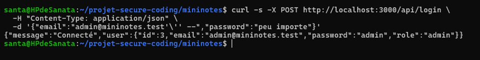
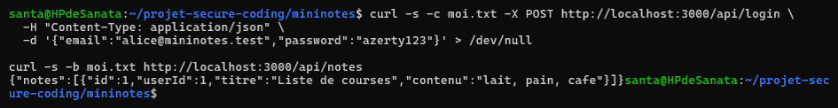


- APRÈS (même commande) :

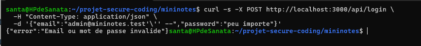
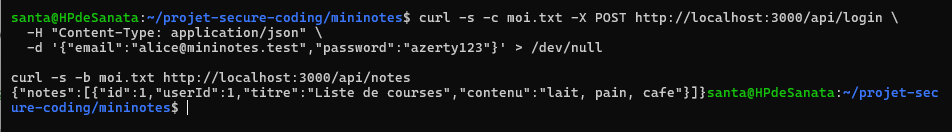


**Non-régression vérifiée** : login normal d'Alice → toujours
`{"message":"Connecté",...}` (200) ; `GET /api/notes` → renvoie
toujours les notes d'Alice ; `POST /api/notes` → création toujours
fonctionnelle.

---

### Faille #1 — Mots de passe en clair — Élevé — A02

**Problème** : `lib/sqldb.ts` stockait les mots de passe en clair
(`'azerty123'`) directement dans la base, et `app/api/login/route.ts`
les comparait avec `===`.

**Correctif (cause racine)** : hachage avec **bcrypt**
(`bcrypt.hashSync(motDePasse, 10)`) au moment du seed, et comparaison
via `bcrypt.compare(password, user.password)` au login — jamais de
comparaison de texte en clair.

- Avant : `password: "azerty123"` stocké tel quel.
- Après : `password: "$2a$10$..."` (hash bcrypt, irréversible).

**Preuve** : inspection de la table `users` en mémoire (via
`console.log` temporaire) confirme que seul le hash est stocké ;
`bcrypt.compare("azerty123", hash)` retourne `true`,
`bcrypt.compare("mauvaismdp", hash)` retourne `false`.

**Non-régression vérifiée** : login d'Alice toujours fonctionnel avec
son mot de passe en clair habituel (`azerty123`) — bcrypt gère la
comparaison de façon transparente côté utilisateur.

---

### Faille #4 — Fuite de l'objet user complet + message d'erreur bavard — Élevé/Moyen — A01/A02/A07

**Problème** : la réponse de `/api/login` renvoyait l'objet `user`
complet, y compris le mot de passe (haché ou non) ; et le message
d'erreur précisait l'email testé (`"Aucun compte ${email}..."`),
permettant l'énumération de comptes valides.

**Correctif (cause racine)** : réponse réduite au strict nécessaire
(`{ id, email, role }`), et message d'erreur **neutre et identique**
("Email ou mot de passe invalide") que l'email existe ou non.

- Avant : `NextResponse.json({ message: "Connecté", user })` (objet complet).
- Après : `NextResponse.json({ message: "Connecté", user: { id: user.id, email: user.email, role: user.role } })`.

**Preuve — AVANT/APRÈS** :
- AVANT : réponse contenait `"password":"azerty123"`.
- APRÈS : réponse ne contient plus que `id`, `email`, `role`.
- AVANT : email inconnu → `"Aucun compte x@y.com avec ce mot de passe"`.
- APRÈS : email inconnu OU mauvais mot de passe → message identique
  `"Email ou mot de passe invalide"`.

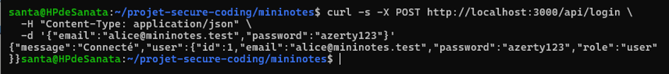
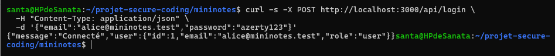

**Non-régression vérifiée** : login normal toujours fonctionnel,
informations essentielles (id, email, role) toujours disponibles côté
client pour la suite de l'app.

---

### Faille #7 — Cookie de session non-httpOnly — Moyen — A05/A07

**Problème** : le cookie `mininotes_session` était posé avec
`httpOnly: false`, le rendant lisible via `document.cookie` en
JavaScript — donc volable par n'importe quel XSS.

**Correctif (cause racine)** : ajout des attributs `httpOnly: true`,
`secure: true`, `sameSite: "lax"`.

- Avant : `res.cookies.set("mininotes_session", ..., { httpOnly: false, path: "/" })`.
- Après : `res.cookies.set("mininotes_session", ..., { httpOnly: true, secure: true, sameSite: "lax", path: "/" })`.

**Preuve** :

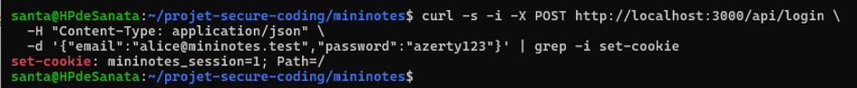
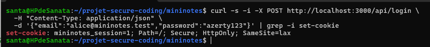

La présence de `HttpOnly` confirme que le cookie n'est plus accessible
en JavaScript.

**Non-régression vérifiée** : la session continue de fonctionner
normalement pour les requêtes authentifiées (`GET /api/notes`
fonctionne toujours via le cookie).

---

### Faille #9 (validation) — Absence de validation des entrées — Moyen — A04

**Problème** : `POST /api/notes` acceptait n'importe quel JSON sans
validation de format, type ou taille.

**Correctif (cause racine)** : ajout d'un schéma **Zod**
(`lib/validation.ts`) avec `safeParse`, retournant `400` si invalide.
Cette validation **complète** (ne remplace pas) le paramétrage SQL :
Zod garantit la forme des données, le paramétrage garantit qu'elles ne
cassent pas la syntaxe SQL.

```typescript
export const noteSchema = z.object({
  titre: z.string().min(1).max(120),
  contenu: z.string().max(5000),
});
```

**Preuve — AVANT/APRÈS** :
- AVANT : `{"titre":"","contenu":"test"}` → note créée avec titre vide.

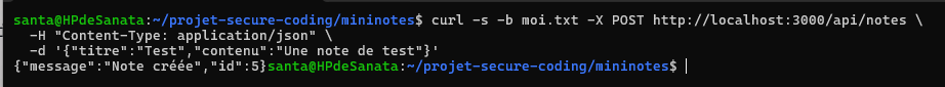

- APRÈS : même payload → `400 { "error": "Données invalides", "details": {...} }`.

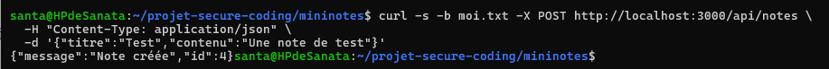

**Non-régression vérifiée** : `POST /api/notes` avec un titre/contenu
valides crée toujours la note normalement.

**PREUVE**

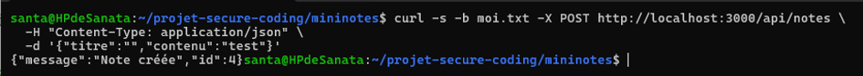
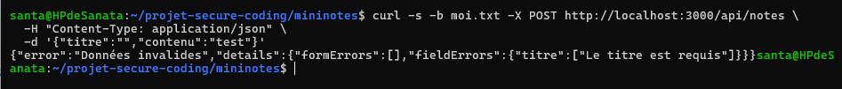

### Faille #10 — IDOR sur `/api/notes/[id]` — Élevé — A01

**Problème** : la route `GET /api/notes/[id]` récupérait une note par
son `id` avec une requête déjà **paramétrée** (donc pas d'injection
SQL ici), mais ne vérifiait **jamais** si cette note appartenait
réellement à l'utilisateur connecté. N'importe quel utilisateur
authentifié pouvait lire la note de n'importe qui d'autre en changeant
simplement l'`id` dans l'URL.

**Correctif (cause racine)** : ajout d'un contrôle d'accès **côté
serveur**, directement dans la requête SQL — on filtre désormais sur
`id` **ET** `userId` (celui du cookie de session). Si la note existe
mais appartient à un autre utilisateur, la requête ne retourne aucune
ligne, et l'API répond `404 Note introuvable` — exactement la même
réponse que si la note n'existait pas, pour ne pas révéler son
existence à un utilisateur non autorisé.

- Avant :
```typescript
  const rows = db("SELECT * FROM notes WHERE id = ?", [Number(id)]);
  // pas de vérification de propriété
```
- Après :
```typescript
  const sessionId = req.cookies.get("mininotes_session")?.value;
  if (!sessionId) return NextResponse.json({ error: "Non connecté" }, { status: 401 });

  const rows = db("SELECT * FROM notes WHERE id = ? AND userId = ?", [
    Number(id),
    Number(sessionId),
  ]);
```

**Preuve — AVANT/APRÈS** :

- AVANT :

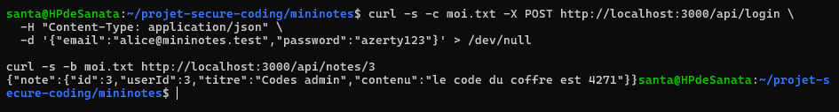

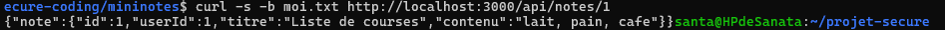

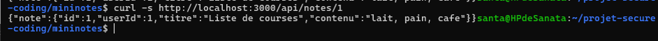

Alice (id=1) lisait la note privée de l'admin (id=3). ❌

- APRÈS (même commande) :

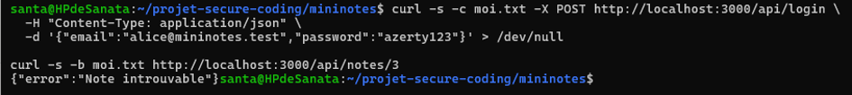

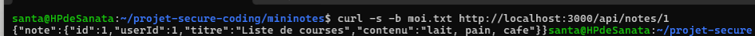

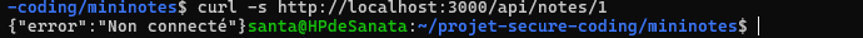

L'accès à la note d'autrui est désormais bloqué. ✅

**Non-régression vérifiée** :
- Alice peut toujours lire **sa propre** note (`GET /api/notes/1` →
  200, contenu correct).
- Un appel sans cookie de session est rejeté avec `401 Non connecté`,
  confirmant que le contrôle d'authentification est bien la première
  vérification appliquée.

**Note méthodologique** : ce correctif illustre bien la différence
entre une requête *paramétrée* (qui protège contre l'injection SQL) et
un *contrôle d'accès* (qui protège contre l'IDOR) — ce sont deux
protections **indépendantes et complémentaires** ; avoir l'une ne
dispense jamais de l'autre.

### Faille #12 — XSS stocké sur `/commentaires` — Élevé — A03

**Problème** : la page `app/commentaires/page.tsx` affichait le champ
`html` de chaque commentaire via `dangerouslySetInnerHTML`, qui insère
le contenu **tel quel** dans le DOM, sans aucun échappement. Un
attaquant pouvant poster un commentaire (ou dont le commentaire serait
stocké via une faille amont) pouvait y injecter du JavaScript
arbitraire, exécuté automatiquement chez **chaque visiteur** de la
page.

**Correctif (cause racine)** : suppression de `dangerouslySetInnerHTML`,
remplacé par un affichage `{c.html}` classique. React échappe
**automatiquement** tout ce qui est inséré entre accolades `{ }` — le
contenu est donc toujours traité comme du **texte**, jamais comme du
HTML actif, quel que soit son contenu.

- Avant :
```tsx
  <span dangerouslySetInnerHTML={{ __html: c.html }} />
```
- Après :
```tsx
  {c.html}
```

**Preuve — AVANT/APRÈS** :

- AVANT : un commentaire contenant
  `` déclenchait une **fenêtre
  d'alerte JavaScript** à l'ouverture de la page — capture d'écran
  jointe (`avant-xss.png`) montrant l'alerte exécutée. ❌

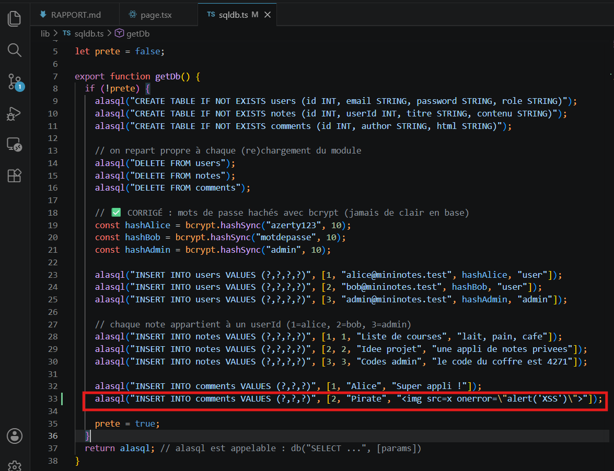  
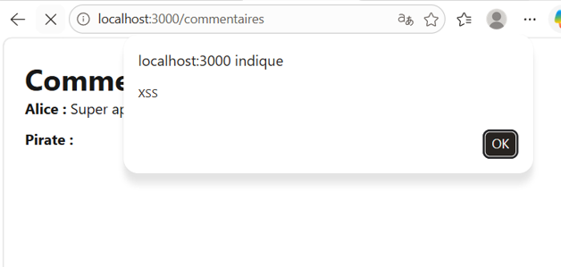

- APRÈS (même commentaire en base) : la page affiche le texte
  **littéral** `` sans déclencher
  aucune alerte — capture d'écran jointe (`apres-xss.png`). Vérification
  technique via `curl` : le contenu renvoyé dans le HTML contient les
  entités échappées `&lt;img src=x onerror=...&gt;` au lieu de la
  balise active, confirmant que React a neutralisé l'injection. ✅

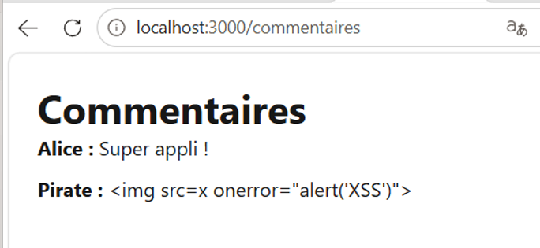

**Non-régression vérifiée** : le commentaire normal d'Alice
("Super appli !") s'affiche toujours correctement sur la page.

**Limite assumée** : cette correction empêche tout HTML, y compris du
HTML "riche" légitime (gras, liens). Si une mise en forme riche est
nécessaire à l'avenir, la bonne pratique est d'utiliser une librairie
de *sanitization* comme **DOMPurify** plutôt que de revenir à
`dangerouslySetInnerHTML` brut (mentionné en bonus dans le brief,
non implémenté ici par choix de rester sur la solution la plus sûre).

### Faille #2 — Secret en dur dans le code commité — Élevé — A05

**Problème** : `lib/config.ts` contenait la constante `SESSION_SECRET`
écrite **en clair** directement dans le code source, et ce fichier
était commité dans Git dès le commit initial. Un secret commité reste
visible dans l'historique Git pour quiconque a accès au dépôt — même
si on le supprime du fichier plus tard, il subsiste dans le passé du
projet (`git log -p`).

**Correctif (cause racine)** : déplacement du secret dans **`.env.local`**
(fichier ajouté au `.gitignore`, jamais commité), avec lecture via
`process.env.SESSION_SECRET`. Un fichier **`.env.example`** (sans la
vraie valeur) est fourni pour que les autres développeurs sachent quelle
variable configurer.

- Avant :
```typescript
  export const SESSION_SECRET = "mn_live_8f3c1a9e2b7d4f60_PROD_DO_NOT_SHARE";
```
- Après :
```typescript
  export const SESSION_SECRET = process.env.SESSION_SECRET ?? "";
```

**Preuve — AVANT/APRÈS** :

- AVANT :

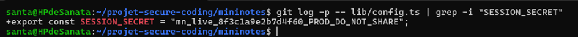

Le secret est visible en clair dans le code source actuel. ❌

- APRÈS : `lib/config.ts` ne contient plus aucune valeur secrète en
  dur ; `git check-ignore -v .env.local` confirme que le fichier
  contenant la vraie valeur est désormais ignoré par Git. ✅

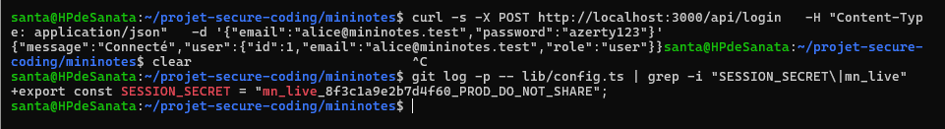

**Non-régression vérifiée** : le login continue de fonctionner
normalement (`{"message":"Connecté",...}`), confirmant que le secret
est bien lu correctement depuis `.env.local`.

**Limite assumée et documentée honnêtement** : déplacer le secret
**ne le retire pas de l'historique Git passé** — la commande
`git log -p -- lib/config.ts | grep SESSION_SECRET` continue de le
révéler dans les anciens commits. La bonne pratique professionnelle
complète aurait été de **roter** ce secret (générer une nouvelle
valeur et invalider l'ancienne) en plus de le déplacer, voire de
réécrire l'historique Git (`git filter-repo` ou BFG Repo-Cleaner) sur
un vrai projet en production. Non fait ici car ce secret n'est pas
utilisé pour un chiffrement réel dans ce labo — mais le principe est
documenté pour montrer la compréhension de l'enjeu.


## 4. Durcissement


## 5. Ce qui reste à faire / limites